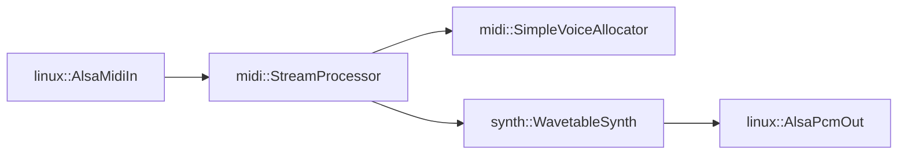

# Pressence Embedded MIDI Synthesizer

This codebase contains platform-independent code for the following:

* *lib/midi*: MIDI stream decoder which drives a `Synth` implementation

There are also platform-dependent modules that arrange to receive MIDI streams,
pipe them through the stream processor into one or more synths, and then out
to a PCM audio sink.

* *lib/linux*: ALSA-based MIDI input and audio sink
* *lib/esp*: ESP32 MIDI input and audio sink (various DAC peripherals)

Example hookup on a Linux build (arrows indicate direction of API calls):



Notes:
* `synth::WavetableSynth` implements `midi::Synth`
* `midi::SimpleVoiceAllocator` implements `midi::SynthVoiceAllocator`.
  * The voice allocator owns the instances of `synth::WavetableSynth` and manages their lifecycles based on which note triggered them
  * `midi::SimpleVoiceAllocator` uses a factory function (supplied to its constructor) to create the Synth instances during construction
* Dynamic memory allocation is confined to setup and tear-down time; no allocations happen while the synths are running

## Build and Run

### Native Linux executable

```bash
source ~/.platformio/penv/bin/activate
pio run -e native
.pio/build/native/program
```
