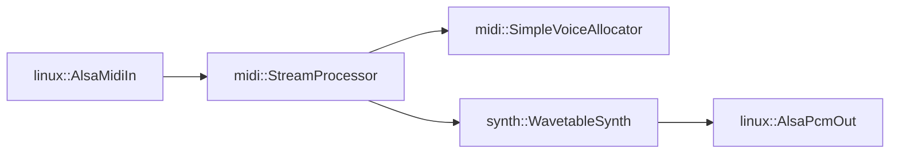

# Pressence Embedded MIDI Synthesizer

This codebase contains platform-independent code for the following:

* *lib/midi*: MIDI stream decoder which drives a `Synth` implementation

There are also platform-dependent modules that arrange to receive MIDI streams,
pipe them through the stream processor into one or more synths, and then out
to a PCM audio sink.

**Interface code**
* *lib/common*: Type definitions  ???
Probably want to separate concrete common types vs. interfaces that need to be implemented by hardware platforms (linux, mac, esp32, rp2040, rp2350)

**Implementaion code**
* *lib/synth*: Platform-independent polyphonic subtractive synthesizer.
* *lib/midi*: Platform-independent MIDI processor. Drives the synth voices.
* *lib/linux*: Linux-specific implementations of the generic interfaces (ALSA-based MIDI input and audio sink).
* *lib/esp*: ESP32-specific implementations of the generic interfaces (audio sink, preset storage, capacitive key scanning).
* *lib/nlohmann*: Third-party JSON input and output library (for storing synth presets).

**Entry points**
* *src/*: Main methods for desktop and embedded

Example hookup on a Linux build (arrows indicate direction of API calls):



Notes:
* `synth::WavetableSynth` implements `midi::Synth`
* `midi::SimpleVoiceAllocator` implements `midi::SynthVoiceAllocator`.
  * The voice allocator owns the instances of `synth::WavetableSynth` and manages their lifecycles based on which note triggered them
  * `midi::SimpleVoiceAllocator` uses a factory function (supplied to its constructor) to create the Synth instances during construction
* Dynamic memory allocation is confined to setup and tear-down time; no heap allocations happen while the synths are running

## Build and Run

### Native Linux executable

```bash
source ~/.platformio/penv/bin/activate
pio run -e native
.pio/build/native/program
```

### ESP32 DEVKITV1

```bash
source ~/.platformio/penv/bin/activate
pio run -e esp32dev
```

You might get a Python stack trace mentioning IntelHex. The library didn't auto-install for me. You can install it with:

```bash
source ~/.platformio/penv/bin/activate
pip install intelhex
```
