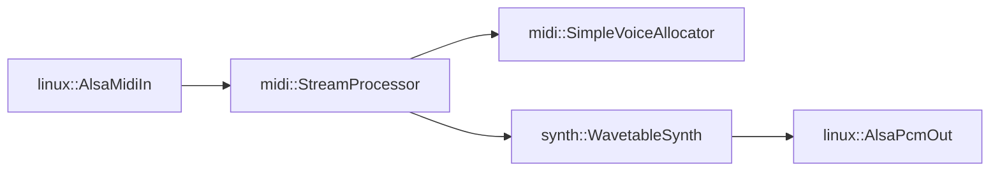

# Pressence Embedded MIDI Synthesizer

Pressence is a multi-platform software synthesizer with an emphasis on continuous
pressure sensing (aka MIDI polyphonic aftertouch).

High-level architecture, from input side to output side:

* Optional hardware key scanning
  * → Outputs MIDI messages (note on, continuous note pressure, note off)
* MIDI out (from key scanner) and in (to MIDI state machine) is possible at this layer
  * For example, the Linux build doesn't include a key scanner, but it feeds ALSA MIDI to the synth
  * Similarly, a low-power microcontroller could scan keys and transmit MIDI, omitting synthesis entirely
* MIDI parser/state machine with pluggable note-to-voice allocation algorithms
  * Can be fed programmatically from any source
    * Current: the capacitive key scanner
    * Future ideas: UART MIDI, USB MIDI, sequencer
  * → Interfaces with the synth voice allocator; triggers and releases notes
* Synthesizer abstraction & toolkit
  * Currently one implementation: subtractive synthesizer with morphable Sawtooth/Triangle/Square waveforms
  * Reusable biquad filter, composable with envelope generator
  * Reusable ADSR envelope generator
  * Voice mixing with various clipping/distortion algorithms
  * There's room to implement other types of synth engines without worrying about note-to-voice allocation, mixdown, etc.
  * Future idea: could implement a tracker module that ignores the voice allocator and drives voices directly (one voice per track)
* Audio output
  * The ESP32 implementation drives an external DAC via I2S
  * The Linux implementation outputs to ALSA (useful for embedded Linux projects)
  * Future: probably should include an option for Pipewire or JACK

## Code organization

(See also: [CODING_STANDARDS.md] for more detailed rules about use of macros, error handling, and so on.)

Each file fits into one of three broad categories:

1. Abstractions/Interface Definitions - defines behaviour that must be implemented using hardware- or OS-specific code
2. Platform-Independent code - compiles and runs on any system (desktop, microcontroller, Linux, Mac, etc.)
3. Non-portable Code - implements the abstractions so the platform-neutral code can make noise!

Higher-numbered items can depend on lower-numbered items, but not vice-versa.

**Abstract Interfaces**
* *lib/features*: Abstract interfaces for platform-specific features (program storage, clipboard).
* *lib/platform*: Platform-agnostic application logic that uses dependency injection for platform-specific implementations.

**Platform-Independent Implementation Code**
* *lib/synth*: Platform-independent polyphonic subtractive synthesizer (DSP algorithms).
* *lib/midi*: Platform-independent MIDI processor. Drives the synth voices.
* *lib/nlohmann*: Third-party JSON input and output library (for storing synth presets).

**Platform-Specific Implementation Code**
* *lib/linux*: Linux implementations (ALSA MIDI/audio, filesystem program storage, preset clipboard).
* *lib/esp32*: ESP32 implementations (I2S audio sink, embedded program storage, capacitive key scanning).
* *src/*: Main entry points. One per target OS/platform.

Example hookup on a Linux build (arrows indicate direction of API calls):



Notes:
* `synth::WavetableSynth` implements `midi::Synth`
* `midi::SimpleVoiceAllocator` implements `midi::SynthVoiceAllocator`.
  * The voice allocator owns the instances of `synth::WavetableSynth` and manages their lifecycles based on which note triggered them
  * `midi::SimpleVoiceAllocator` uses a factory function (supplied to its constructor) to create the Synth instances during construction
* Dynamic memory allocation is confined to setup and tear-down time; no heap allocations happen while the synths are running

## Build and Run

### Native Linux executable

```bash
source ~/.platformio/penv/bin/activate
pio run -e native
.pio/build/native/program
```

Running the program without arguments will present a list of hardware MIDI devices. Plug in a USB MIDI device
or pair a BLE MIDI device, and it should appear in the list.

To use a virtual keyboard:

* `sudo modprobe snd_virmidi`
  * To view the list of virtual MIDI devices:
    * Command line: `aconnect -i`
    * GUI: `qpwgraph` (requires PipeWire with ALSA bridge, on by default on Ubuntu)
* Run `vmpk` (Virtual MIDI Piano Keyboard)
  * Edit → MIDI Connections
    * MIDI Out Driver: ALSA
    * Output MIDI Connection: Virtual Raw MIDI 2-0
* `.pio/build/native/program hw:2,0,0`

### ESP32 DEVKITV1

```bash
source ~/.platformio/penv/bin/activate
pio run -e esp32dev
```

You might get a Python stack trace mentioning IntelHex. The library didn't auto-install for me. You can install it with:

```bash
source ~/.platformio/penv/bin/activate
pip install intelhex
```
